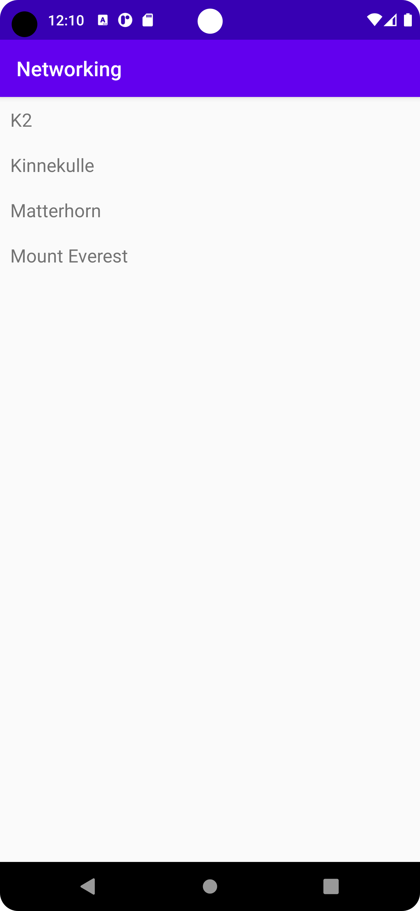

# Rapport

Först skapas klassen "Mountain", samt en arraylist i MainActivity som ska innehålla Mountain-objekten.
Mountain-klassen har attributen "name", "location" och "height", men det är endast name som vi är intresserade
av att visa på vår display. En extra constructor finns till i fall data skulle vara null.

```
public class Mountain {
private String name;
private String location;
private int height;

    public Mountain () {
        name="Saknar namn";
        location="Saknar plats";
        height=-1;
    }

    public Mountain(String name, String location, int height) {
        this.name = name;
        this.location = location;
        this.height = height;
    }

    public String getName() {
        return name;
    }

}
```

Därefter läggs det till en RecyclerView på MainActivity som ska visa en lista på vad som finns i Arraylistan.
En ny XML fil i mappen layout kallad recyclerview_item skapas, som definierar hur objekt i RecyclerView ska visas på skärmen.

Det behövs även en adapter som ser till att visa data i RecyclerView. Denna instansieras i MainActivity och kopplas
till vår RecyclerView.

```
adapter = new RecyclerViewAdapter(this, mountainArrayList, new RecyclerViewAdapter.OnClickListener() {
    @Override
    public void onClick(Mountain item) {
        Toast.makeText(MainActivity.this, item.getName(), Toast.LENGTH_SHORT).show();
    }
});

RecyclerView view = findViewById(R.id.recycler_view);
view.setLayoutManager(new LinearLayoutManager(this));
view.setAdapter(adapter);

}
```

JSON-data hämtas från "https://mobprog.webug.se/json-api?login=brom" genom att exekvera JSONTask.

```
new JsonTask(this).execute(JSON_URL);
```

Datan skickas sedan till onPostExecute i MainActivity, där den blir parsad med hjälp av biblioteket Gson, och
läggs till som mountain-objekt i mountainArrayList. Listan skickas sedan in i adaptern som uppdaterar displayen.

```
    @Override
    public void onPostExecute(String json) {
        Log.d("MainActivity", json);
        Type type = new TypeToken<ArrayList<Mountain>>() {}.getType();
        mountainArrayList = gson.fromJson(json, type);
        adapter.setItems(mountainArrayList);
        adapter.notifyDataSetChanged();

    }
```

